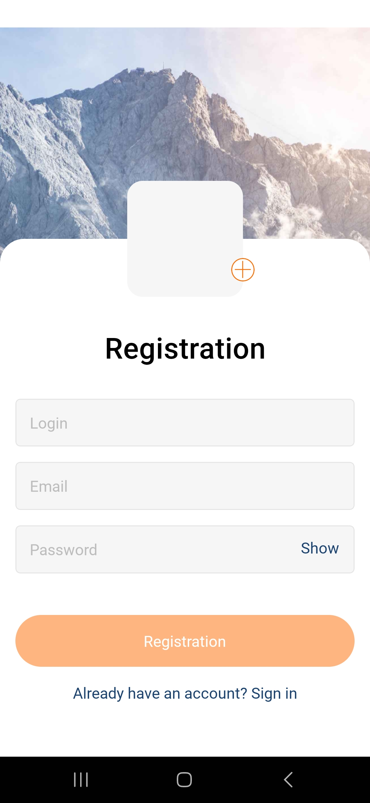

# Social Media App

Welcome to the Social Media App – an innovative social platform that enables users to share content, interact, and explore the world in entirely new ways. Built with the goal of providing a unique user experience, this application combines advanced social media functionalities with an intuitive interface, allowing for easy sharing of photos, updates, and life moments.

  
  
  

 

  
  
  

## Key Features

- **Content Sharing:** Create and publish posts with text, photos, and locations.
- **Social Interactions:** Likes, comments, and shares facilitate dynamic interactions among users.
- **Profile Customization:** Customize your profile by updating your profile picture and personal information.
- **Location and Maps:** Discover content and users based on your location.

## Technical Overview

This application is developed on a contemporary technology stack designed to offer a fluid and effective user experience across both Android and iOS platforms. By integrating the robustness of React Native and the convenience of Expo with the precision of TypeScript, the application delivers a comprehensive array of social media functionalities, including content sharing, user interactions, and location services. Significantly, instead of using Redux for state management, the application employs React's Context API with a Provider pattern, enhancing its architecture and development process.

### Core Technologies and Libraries

- **React Native:** Enables cross-platform mobile app development, allowing the application to run on both Android and iOS devices with a unified codebase.
- **Expo:** Simplifies the development and deployment process as a framework and platform for universal React applications. It is used for easy access to native device features and for deploying the application on the Expo server.
- **Firebase:** Provides backend functionalities such as authentication, database storage, and hosting for the application's data and user-generated content.
- **React Navigation:** Facilitates seamless and intuitive navigation within the app across different screens and functionalities.
- **TypeScript:** Offers a superior development experience with static type checking, code autocompletion, and early error detection, enhancing code quality, maintainability, and developer productivity.

### State Management

**Context API with Provider Pattern:** Instead of adopting Redux, this application utilizes React's Context API coupled with a Provider pattern for state management. This approach simplifies the passing of data throughout the application, eliminating the need for prop drilling and making the state management more accessible and maintainable. It is particularly advantageous for applications with a moderate scale of state management needs, providing a more straightforward and efficient solution compared to the boilerplate and complexity that can sometimes accompany Redux setups.

### Deployment and Configuration

Deployed on the Expo server, the application is available in a test version, showcasing rapid development and deployment capabilities, with TypeScript and the Context API enhancing its reliability and scalability.

### Running the Application for Developers

Developers aiming to run the application from the source should:

1. Clone the repository and install dependencies using **npm install**.
2. Obtain a Google Maps API key for integrating location-based features.
3. Use the **npx expo start** command to launch the application, benefiting from TypeScript's compile-time checks and the streamlined state management provided by the Context API.

#### API Integration and Security

The integration with Google Maps API demonstrates the application's advanced use of external APIs, with TypeScript ensuring type-safe interactions.

### Running the Application for Users

To try the test version of the Social Media App, simply <a href="https://expo.dev/artifacts/eas/5anAXRMK6NZ9DqQpJYvZz8.apk"> download the APK here </a> to Android device, then open and install it. During the installation process, a warning about installing apps from unknown sources may appear - users should allow the installation to proceed. This is a standard procedure for apps installed outside the Google Play Store.

### Potential for Expansion

The application's current functionalities serve as a foundation for scalability, thanks to TypeScript and the flexible state management approach using React's Context API. This setup allows for the future addition of more complex features, paving the way for the application to evolve into a comprehensive social networking solution.

---

The decision to use React's Context API over Redux reflects a strategic choice to streamline state management and improve the application's overall architecture and development efficiency. This choice is aligned with modern development practices, ensuring the app remains maintainable and scalable as it grows.

## Application Functionalities

This application delivers a comprehensive suite of features enabling users to create, share, and engage with content in a dynamic environment. With an intuitive interface and sophisticated backend functionalities, users can effortlessly navigate the application and utilize its extensive capabilities.

### Registration and Login

- **User Registration:** New users can easily register by providing their details and optionally a profile picture.
- **Login:** Features secure login functionality using email and password, granting access to individual user accounts.

### Profile Management

- **Update Profile:** Users can update their profile details, including their profile picture, allowing for personalization of their presence within the application.
- **Image Management:** Offers the ability to upload images for profiles and posts, along with automatic processing and hosting.

### Content Creation and Management

- **Adding Posts:** Users can create posts with images and text, which are then published on the application's global feed or on user profiles.
- **Comments and Likes:** Allows interaction with posts through the ability to add comments and likes, fostering community engagement and user interaction.
- **Post and Comment Management:** Users have the control to delete their own posts and comments, providing them with autonomy over the content they publish.

### Location and Address

- **Location Data:** The application can retrieve and store user location data, which can be used for content personalization or displaying location-based information.
- **Address Lookup:** Based on geolocation data, the application can obtain addresses, enriching posts with location information.

### Social Interactions

- **Browsing Posts:** Users can browse posts from across the platform or from specific users, facilitating the discovery of new content.
- **Like Management:** The like functionality allows users to express approval of content, with the system tracking these interactions for each post.

### Additional Features

- **Image Upload and Storage:** Advanced features for uploading and storing images on the server.
- **Application State Management:** Comprehensive management of the application state, including user information, posts, comments, and location details.

## Acknowledgements

I would like to express my gratitude to the creators of all the libraries that have been utilized in the Social Media App project. Your work has been instrumental in the development of this application, providing essential tools and resources that enhanced its functionality and user experience. Your dedication to open-source software is greatly appreciated.
